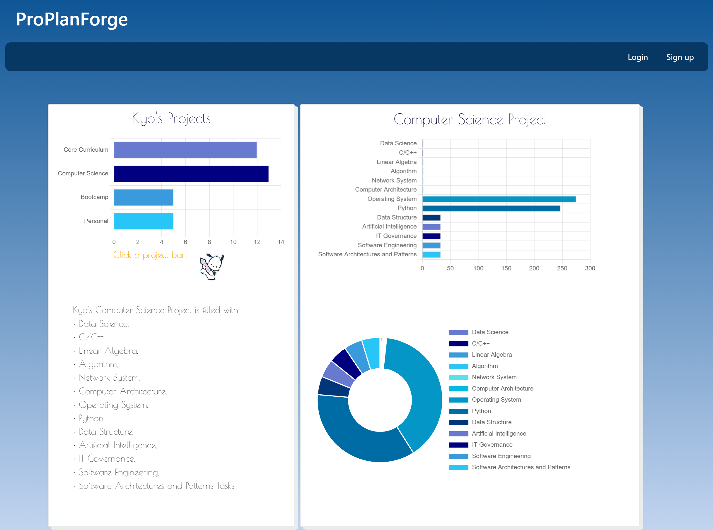

# ProPlanForge

An application built for project management and keeping track of day to day life.

[](https://opensource.org/licenses/MIT)

---

## Contents

1. [About](#about)
2. [Story](#user-story)
3. [Visuals](#visuals)
4. [Installation](#installation)
5. [License](#license)
6. [Contributing](#contributing)
7. [Contact](#contact)

---

## About

ProPlanForge is built to aid any user looking to maintain control and tracking of daily life, appointments, projects and whatever else the user is seeking to keep up with through deadlines, dates and underlying tasks.

---

### User Story

```
AS A assiduous person
I WANT to be able to manage and track any tasks
SO THAT I can maintain structure and efficiency in my day to day life
```

## Visuals:



[Link to our UI Design Map for our Website](https://www.canva.com/design/DAF0Gc6iu6o/_ajUL3nMiy7WwBeNRLw7Vg/edit?utm_content=DAF0Gc6iu6o&utm_campaign=designshare&utm_medium=link2&utm_source=sharebutton)

[Presentation slideshow for ProPlanForge](https://prezi.com/view/PJV2LhsldHWI8A2CtYLa/)

[Heroku deployment](https://mysterious-sands-89389-6bcd1486e90b.herokuapp.com/)

---

## Installation:

```
To clone the repo:

git clone in gitbash
```

---

## License

License used for this project - MIT

- For more information on license types, please reference this website
  for additional licensing information - [https://choosealicense.com/](https://choosealicense.com/).

---

## Contributing:

To contribute to this application, create a pull request.
Here are the steps needed for doing that:

- Fork the repo
- Create a feature branch (git checkout -b NAME-HERE)
- Commit your new feature (git commit -m 'Add some feature')
- Push your branch (git push)
- Create a new Pull Request

Following a code review, your feature will be merged.

---

## Contact:

- GitHub Usernames: [whatnameshouldiuse](https://github.com/whatnameshouldiuse)
  [alla0810](https://github.com/alla0810)
  [Fucolution](https://github.com/Fuvolution)
  [WinGonzalez](https://github.som/WinGonzalez)
  [conquerersHaki](https://github.com/conquerersHaki)
